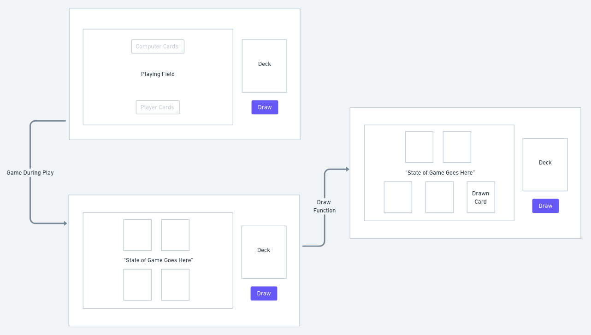

# BLACKJACK
## Objective:
Create a browser game simulating Blackjack

### Getting Started:
Play the game [here.](https://wangmanlex.github.io/Blackjack/)

## Prototypes/Wireframing
### Wireframe:

### Functional game before styling: 

### Game after styling:

## Technology implemented:
* Javascript
* CSS
* HTML
* Git
* bootstrap

## Psuedocode:
- Define constants and variables such as card deck, player hand/computer hand, is winner , and center message.
- Add event listeners to draw button and reset button.
- Create initial function that empties hand, makes winner to null, and refills the deck that is drawn from.
- Create function that randomly draws a card when hit
- Create a function when player presses Stand, values are compared then rendering
- Create a function return the value of a card passed through as a string
- Make a function comparing the two totals of each players hand.
- get player's total close to 21 then get computer's total and compare therefore render result
- Changes center message to the state of the game so "Its a tie!", "Do you wish to draw?", "You lose !", "You win!!"
- Results should push to its specific places or arrays.

## Stretch Goals